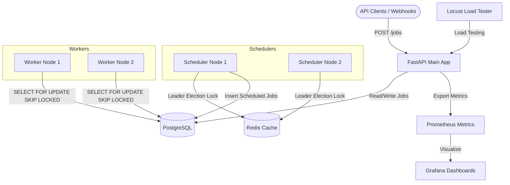

# Distributed Job Scheduler & Orchestration Engine

A production-grade, highly available distributed job scheduling and webhook orchestration engine built from scratch using **FastAPI**, **PostgreSQL**, and **Redis**.

This project implements core distributed systems concepts—including atomic database locking, Redis-backed leader election, exponential backoff, and dead letter queues—making it a resilient backbone for asynchronous workloads.

## 🌟 Why This Project Matters
Basic message brokers are easy to deploy, but they often lack the strict guarantees required for mission-critical financial or orchestration workloads. This project demonstrates how to build a stateful, deadlock-free distributed queue without relying on heavy external frameworks like Celery or AWS SQS. It guarantees **exactly-once execution**, **zero downtime failover**, and **100% data preservation** during catastrophic node failures.

---

## 🏗 Architecture Overview



---

## 🚀 Key Features

- **Concurrent Batch Polling**: High-performance worker nodes safely dequeue jobs simultaneously using PostgreSQL's `SELECT FOR UPDATE SKIP LOCKED`, entirely eliminating race conditions.
- **Distributed Cron Scheduling**: Define complex recurring schedules using standard cron syntax. 
- **High-Availability Schedulers**: Schedulers utilize a Redis distributed lock (with TTL heartbeats) to establish leader election. If the leader crashes, a follower takes over in < 10 seconds.
- **Resilient Retry Engine**: Intermittent failures trigger an algorithmic exponential backoff with random jitter, preventing "thundering herd" bottlenecks.
- **Dead Letter Queue (DLQ)**: Jobs exceeding their maximum attempt quota are securely isolated into a `DEAD_LETTER` state for manual inspection.
- **Idempotency Guarantee**: A strict composite database constraint ensures that the system can never create duplicate cron jobs, even if split-brain leader election occurs.
- **Production Observability**: Built-in Prometheus middleware streams API latencies, worker health, and queue metrics directly to Grafana dashboards.
- **Chaos Tested**: Validated against container kills, database reboots, and retry storms with 0% data loss.

---

## 💻 Tech Stack
- **Frontend**: React, Vite, Axios, Plain CSS (Premium Aesthetic)
- **Backend Framework**: Python 3.11, FastAPI, Pydantic
- **Database Layer**: PostgreSQL 15, SQLAlchemy (Synchronous ORM), Alembic
- **Caching & Locks**: Redis 7
- **Observability**: Prometheus, Grafana
- **Testing**: Locust (Load), Bash (Chaos Engineering)
- **Deployment**: Docker, Docker Compose

---

## 🛠 Local Setup & Installation

### 1. Prerequisites
Ensure you have the following installed:
- [Docker](https://www.docker.com/)
- [Docker Compose](https://docs.docker.com/compose/)

### 2. Clone the Repository
```bash
git clone https://github.com/yourusername/distributed-job-scheduler.git
cd distributed-job-scheduler
```

### 3. Environment Setup
```bash
cp .env.example .env
```

### 4. Start the Infrastructure
```bash
docker compose up -d --build
```
*(Note: Alembic database migrations run automatically on API startup.)*

---

## 📖 How to Use the System

### 1. View API Documentation
Navigate to [http://localhost:8000/docs](http://localhost:8000/docs) to access the interactive Swagger UI.

### 2. Submit a Background Job
```bash
curl -X POST "http://localhost:8000/jobs" \
     -H "Content-Type: application/json" \
     -d '{
           "name": "data_processing_task",
           "payload": {"user_id": 123},
           "priority": 1,
           "max_attempts": 3
         }'
```

### 3. Create a Recurring Cron Schedule
```bash
curl -X POST "http://localhost:8000/schedules" \
     -H "Content-Type: application/json" \
     -d '{
           "name": "daily_report",
           "cron_expression": "0 0 * * *",
           "payload": {"report_type": "summary"}
         }'
```

### 4. Check Chaos & System Health
```bash
curl -s http://localhost:8000/chaos/status | jq
```

---

## 🖥 React Admin Dashboard

A professional, responsive React dashboard is included to manage the orchestration engine. 

### Architecture
- **Frontend**: Served via Vite on port `5173`.
- **Communication**: Communicates with the FastAPI backend via Axios, utilizing standard RESTful endpoints and a simplified JSON metrics payload.
- **Design**: Built with modern glassmorphism UI, variables-driven dark mode, and dynamic metric visualizations.

### Features
- **Dashboard**: High-level real-time overview of jobs and worker statuses.
- **Jobs**: Filter jobs, create new ad-hoc tasks, cancel pending runs, and retry failed tasks.
- **Schedules**: Define complex cron expressions and easily pause/resume distributed background processing.
- **Workers**: Monitor worker health, heartbeats, and exact node process counts.
- **Leader Election**: Real-time view into the Redis-backed lock state for the active scheduler node.
- **Monitoring Quick Links**: Easy access to Prometheus, Grafana, Swagger, and Locust.

### How to Access
Navigate to [http://localhost:5173](http://localhost:5173) after running `docker compose up --build`.

*(Screenshots placeholder: Insert images of the Dashboard here)*

---

## 📈 Observability & Load Testing

### Prometheus
Access raw metrics and time-series data at [http://localhost:9090](http://localhost:9090).

### Grafana Dashboards
Navigate to [http://localhost:3000](http://localhost:3000).
- **Username**: `admin`
- **Password**: `admin`
*Pre-configured dashboards are available out-of-the-box to monitor active workers, job status, and API latencies.*

### Locust Load Testing
1. Navigate to the Locust UI at [http://localhost:8089](http://localhost:8089).
2. Enter the number of users (e.g., `100`) and spawn rate (e.g., `10`).
3. Set the target host to `http://api:8000` and start swarming.
4. Verify the 0% failure rate target.

---

## 🌪 Chaos Testing
To prove the resilience of the scheduler, we've included an automated chaos engineering suite.

Run the entire chaos suite end-to-end:
```bash
./test_chaos.sh
```

**What it tests:**
- **`chaos_kill_worker.sh`**: Kills a worker mid-processing; verifies the timeout sweeper recovers abandoned jobs automatically.
- **`chaos_kill_leader_scheduler.sh`**: Kills the leader scheduler; verifies the Redis lock expires and a follower assumes command.
- **`chaos_restart_postgres.sh`**: Restarts the database under load; verifies SQLAlchemy connection pooling recovers without crashing the API.
- **`chaos_retry_storm.sh`**: Floods the system with failing jobs; verifies exponential backoff and DLQ mechanisms hold strong.

---

## 🔍 Interview & System Design Concepts
If you are reviewing this project, be sure to check out the accompanying documentation explicitly designed for engineering interviews:
- [**PROJECT_SUMMARY.md**](PROJECT_SUMMARY.md): One-pager executive summary.
- [**RESUME_BULLETS.md**](RESUME_BULLETS.md): High-impact, ATS-optimized bullet points.
- [**INTERVIEW_EXPLANATION.md**](INTERVIEW_EXPLANATION.md): Deep-dive explanations of `SKIP LOCKED`, leader election, and idempotency guarantees.

---

## 🚨 Troubleshooting
- **Database Connection Errors**: If `psycopg2` throws connection errors on first boot, ensure Docker has fully allocated the volume. Restarting the API container usually resolves initialization delays: `docker compose restart api`.
- **Workers Not Processing**: Ensure the `worker` container is running: `docker compose ps`. Check logs via `docker compose logs worker`.
- **Port Conflicts**: Ensure ports `8000`, `5432`, `6379`, `9090`, `3000`, and `8089` are free on your host machine.
